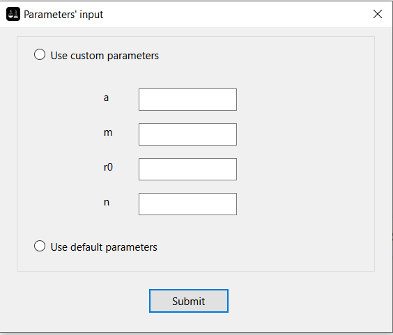
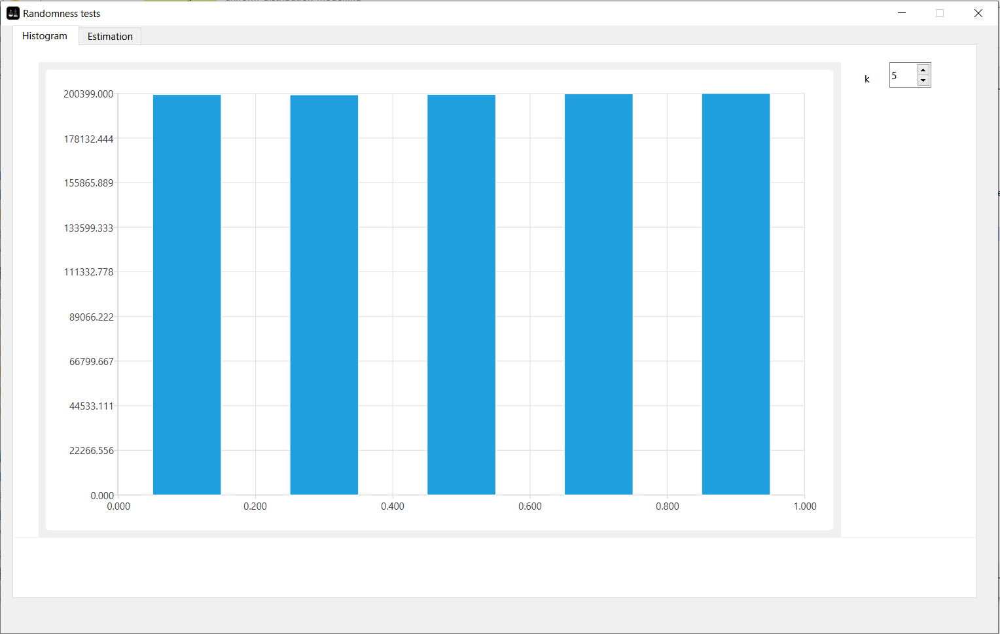
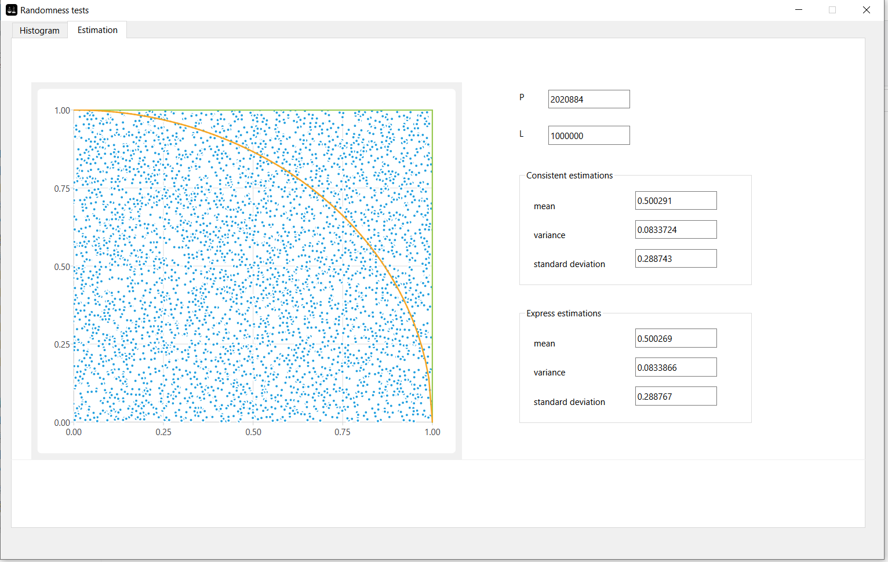

# uniform-distribution-modelling
Project might be helpful if:
  -> you're a student of BSUIR Uni (Simulation Modelling & Analysis (SAiMMod) discipline, task #1)
  -> you're a fan of random number generation

 Project implements Lehmer random number generator and checks its randomness.

 Parameters' input is the first window to appear. 
Here you can choose default parameters for Lehmer's generator or enter yours.

 After hitting submit button you'll see a bar plot which represents "relative" frequencies showing 
the proportion of random numbers that fall into each of five intervals (number of intervals can be changed (from 5 to 25)).

 Switch to the second tab, line plot is here showing random number pairs blackening the unit square(lattice structure would appear if you chose inappropriate parametes).
 Estimations as mean, variance and period are also displayed.

 Doxygen docs are available after the build. Find more there about project structute.

### Tech details 
A poor mix of C++, Cmake and Qt. 
